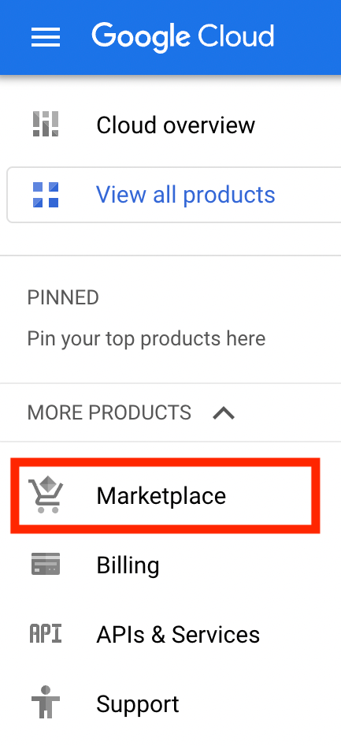
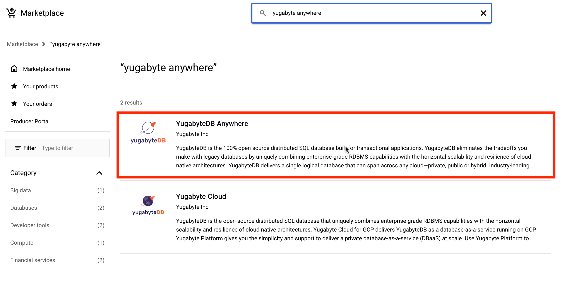
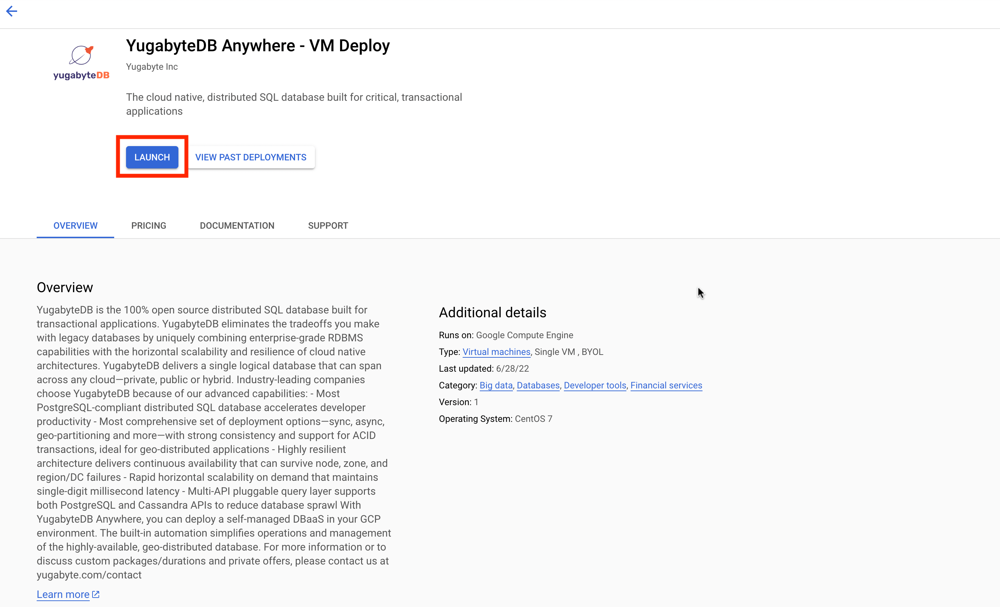
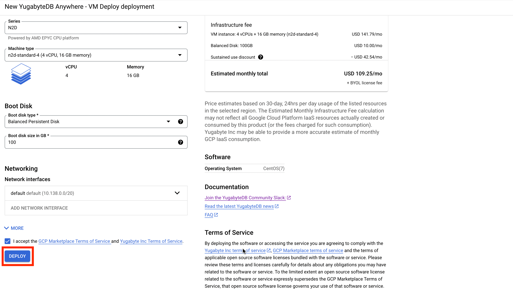

# Overview

Yugabyte Anywhere gives you the simplicity and support to deliver a private database-as-a-service (DBaaS) at scale. Use Yugabyte Anywhere to deploy YugabyteDB across any cloud anywhere in the world with a few clicks, simplify day 2 operations through automation, and get the services needed to realize business outcomes with the database.


## Overview

https://docs.yugabyte.com/latest/yugabyte-platform/overview/


# Installation

Get up and running with a few clicks! Install this Yugabyte Anywhere app to a compute engine using Google Cloud Marketplace

## Quick install with Google Cloud Marketplace

- Go to GCP marketplace
    
    

- Search for Yugabyte Anywhere VM image
    
    

- Review VM details, pricing information and other details. Then click on launch

    

- Configure the VM and click on deploy
    
    

## Command line instructions

### Prerequisites

#### Set up command-line tools

You'll need the following tools in your development environment:

-   [gcloud](https://cloud.google.com/sdk/gcloud/)

#### Create a VM

```shell
gcloud compute instances create VM_NAME \
    [--image=IMAGE | --image-family=IMAGE_FAMILY] \
    --image-project=IMAGE_PROJECT
    --machine-type=MACHINE_TYPE
```

For more information refer to [GCP docs on creating a VM](https://cloud.google.com/compute/docs/instances/create-start-instance)

# Backup and Restore

Follow the [Back Up and Restore Yugabyte Anywhere ](https://docs.yugabyte.com/preview/yugabyte-platform/administer-yugabyte-platform/back-up-restore-yp/) document to know more. 

# Basic Usage

## Access the Yugabyte Anywhere UI

Get the external endpoint from application page in the Google Cloud Console. Follow the [Configure Yugabyte Platform](https://docs.yugabyte.com/latest/yugabyte-platform/configure-yugabyte-platform/) documentation section to know more about it.

# Uninstalling the Application

## Using the Google Cloud Platform Console
- Go to compute engines > VM instances
- Find the instance you wish to delete
- On the instance delete page click on show more options and then delete

## Using the command line

```shell
gcloud compute instances delete INSTANCE_NAME
```
